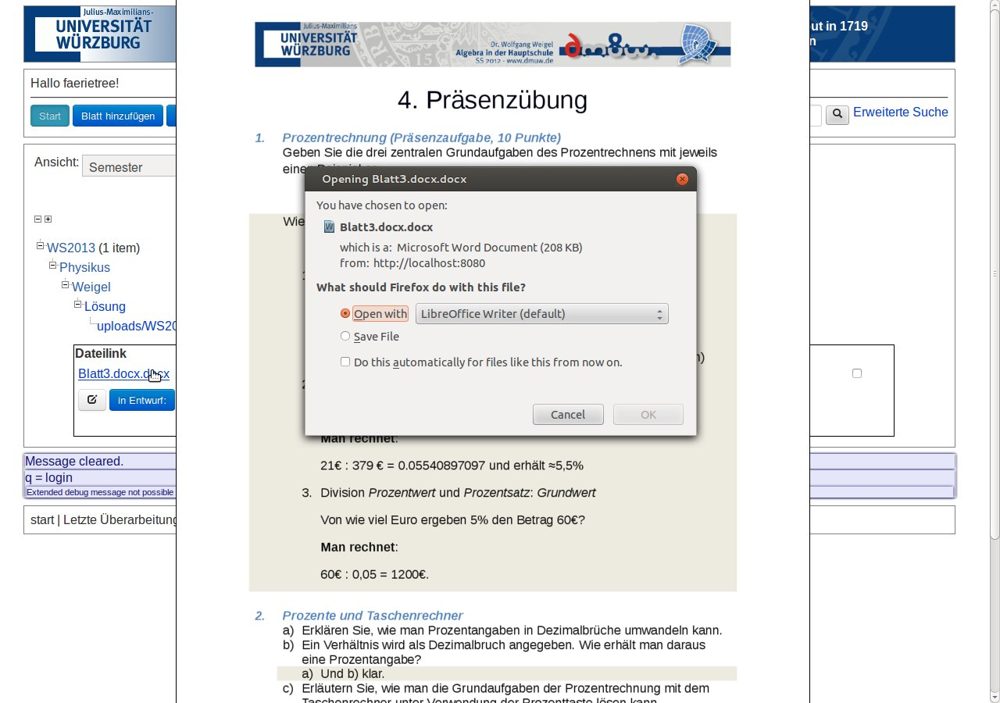

Exercise Management System =: EMS  | Exercise Database
===

Teacher|Lecturer Exercise Database Features
---
* upload DOCX|ODT|TEX|... sheet, split automatically into exercises
* compose new sheet drafts from the potentially world wide exercise pool
* preview
* convert
* share
* download and print for your class|lecture.
* tree, list views
* realtime filtering of views
* exercise <-> solution relationship detection
* statistics (e.g. where which exercise was used)

Capable of converting, splitting sheets into exercises in all common file formats ODT, DOCX, HTML, TXT, RTF, ...
These are then stored in a database and can be chosen and joined into a new sheet draft which can be modified at any time and is ready for download to print it for your class.
Your own uploads as well as those referencing your name are shown when filtering the tree by your own exercises.

Code by J.R.I.Frühholz aka J.R.I.Balzer at service of Dr. Wolfgang Weigel, Prof. Dr. Hans-Georg Weigand of the University of Wuerzburg and later also under Prof. Dr. Frank Puppe, Information technology, Artificial Intelligence, also University of Wuerzburg.

Initial code capable to split TXT, TEX files with basic user interface and preview generation has been developed by a team around Artiom K. at a Software Practice Semester and during an employment at the Chair of Mathematics for Didactics.

Links
---
[University of Wuerzburg](http://uni-wuerzburg.de)
[Chair for Didactics of Mathematics](http://didaktik.mathematik.uni-wuerzburg.de)
[Chair for Information technology VI, Artificial intelligence](http://is.informatik.uni-wuerzburg.de)

About issues & being nice
---
### Background
Splitting, joining random exercises in all kind of file types and then also matching exercise + solution which may be spread across sheets is a very complicated undertaking.
We were the first to follow this deadly path. It included years of stagnation, months of disputes, crawling for other solutions across the globe at no avail, redesign anger and frustration for both W.Weigel and J.R.I.Frühholz.

Finally one single almost exmatriculated bad university student had the luck to become under the extreme pressure to get it done or be exmatriculated. It worked out but hair of all those participating turned into a greyish wilderness.

At this point I'd like to thank W. Weigel from the bottom of my heart as he stood by my side to defend me till the end. I do not deserve such great support! Thank you, Wolfgang!

Also I'd like to thank Prof. Puppe with his many wishes of things to be changed and features to be added which due to my last minute change of thesis topic was just a few weeks before hand-in time. It made the tool better! A lot of fierce random crashes were fixed under this strain that may never have been fixed otherwise.

It was due to his final very generous decision to accept and let my thesis pass that chances to get the aerospace degree were kept up and finally succeeded thanks to periodically recurring easier exam at my last possible chance to let bad students like me pass.

At this point I'd wish to show my gratitude towards Dr. Kiessling, my friends that gave me shelter to recover from the car and quite a few other lecturers who were gentle or generous earlier as well as my employers *Control theory*, *Didactics of Mathematics* and *Aerospace* chairs that helped me a lot enduring quite a lot of extra stress: thanks Nils Gageik, Prof. Montenegro & consorts for this!

### Project issues
So now with that background, if you find issues, e.g. not always perfect mapping of solutions to exercises, then be gentle, report them with instructions to reproduce or provide better code yourself.

